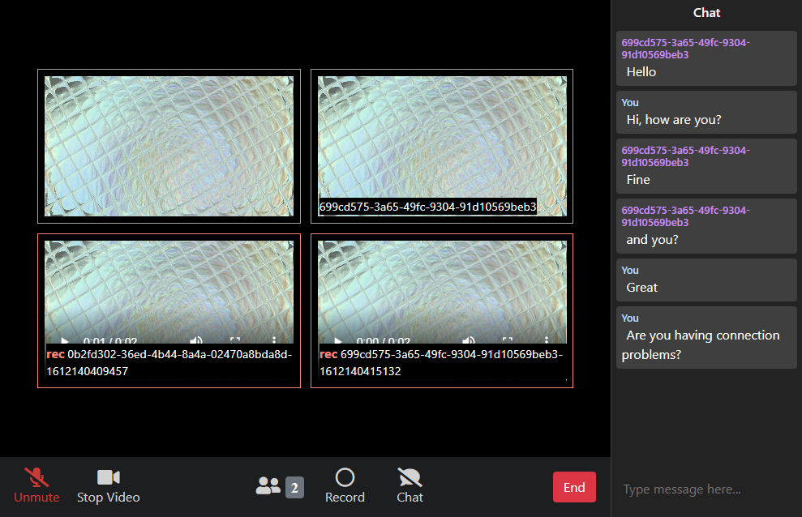

<h1 align="center">
  Zoom<a href="#note-1">1</a> Web Clone
</h1>

  A sample WebRTC video conference application.
   
  <a href="https://erickwendel.com.br">
    Semana <em>JavaScript Expert</em>
  </a>

  

## Features
- Simple video chat using WebRTC with a peer server.
- Real-time user connection management.
- Audio and video chat recording.
- Download of recorded videos (as one zip file containing all videos).
- Home page to start or join a meeting (with a working clock and a simple list of recent enrolled meetings).
- Mute/Unmute, Play/Stop video controls.
- Text messaging chat.

## Quick start
1. Install [NodeJS v12+](https://nodejs.org).

2. Start all the applications, by running the following scripts at the repository root using [PowerShell](https://github.com/PowerShell/PowerShell):
   - `./run peer-server`
   - `./run server`
   - `./run web`

## Suported Browsers
Supported browsers should:
- [Be _ES6_ compliant](https://caniuse.com/es6).
- [Support _Media Devices_](https://caniuse.com/mdn-api_mediadevices_getusermedia).
- [Support _WebRTC_](https://caniuse.com/?search=webrtc).
- [Support _Media Recorder_](https://caniuse.com/?search=media%20recorder).

## Known Issues
- It is necessary to always allow popups on the browser for this site.

## References
- [Get started with WebRTC](https://www.html5rocks.com/en/tutorials/webrtc/basics)
- [Build the backend services needed for a WebRTC app](https://www.html5rocks.com/en/tutorials/webrtc/infrastructure)

## Credits
- The home page layout is a modified version based on [a pen by _Nelson Adonis Hernandez_](https://codepen.io/nelsonher019/pen/eYZBqOm).

- The room page layout and some functions were hugelly inspired by [a repository from the _CleverProgrammers_](https://github.com/CleverProgrammers/nodejs-zoom-clone).

---

  <a name="note-1">1</a>: ZOOM is a registered mark of Zoom Video Communications, Inc.

